# ai-database-2026

AI 에이전트 개발자 데이터베이스 리포지토리

## 1일차

### PostgreSQL 개요

데이터베이스. 데이터를 한 곳에서 관리하는 목적의 시스템

줄여서 Postgre 라고 통칭. **관계형** 데이터베이스.

`SQL`을 통해서 데이터를 저장, 수정, 삭제, 조회 할 수 있는 시스템

- 기타 관계형 데이터베이스
  - Oracle
  - MySQL / MariaDB
  - SQL Server

위 대부분 상용 소프트웨어, Postgre는 **오픈소스 시스템** 라이센스 비용 X

### DB의 특징

- 데이터 무결성
- 데이터 안정성
- 데이터 동시성
- 표준SQL 지원
- 확장성

#### PostgreSQL 설치

#### 기본 설치

- 자신의 OS에 직접 설치하는 방법
- postgresql-18.6-3-windows-x64.exe

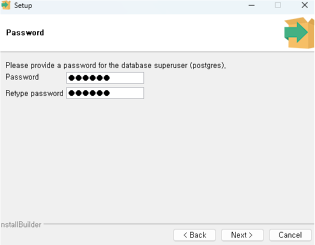

- superuser 아이디 - postgres 패스워드 지정

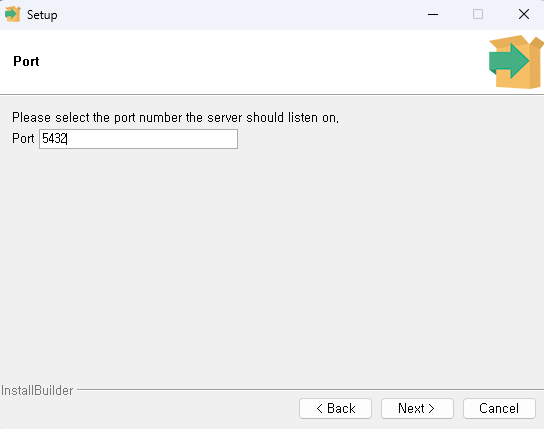

- port 5432 기억할 것

#### DBeaver 설치

GUI DB관리 실행 툴

- 설치 신

#### DB 접속

1. DBeaver 실행
2. 데이터베이스 연결 클릭
3. 데이터베이스 설정

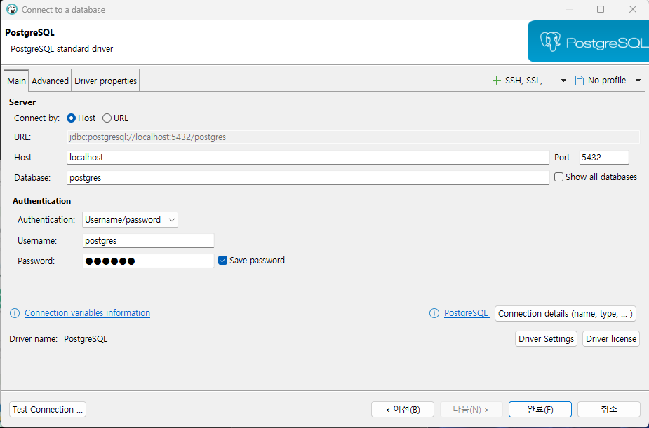

4. Test Connection 클릭 Driver 다운로드 후

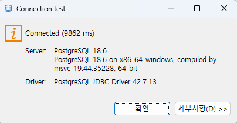

5. 정상 접속 확인 후 완료 클릭

#### Dockr 개요

- 환경의존성 문제를 해결한 컨테이너 기술 솔루션
- 가상환경 상 프로그램 실행하게 제공
- 컨테이너 : OS, 라이브러리, 설정 등 하나의 패키지로 만들어진 이미지
- 기본 Docker 실행 파일 -> Docker Desktop 윈도우에서 Docker를 편하게 사용하도록

### Docker Desktop 설치

- https://docs.docker.com/desktop/setup/install/windows-install/
- 윈도우 버전 다운로드 후 설치
- Close and Restart 이후
- WSL(Windows Subsystem for Line) 추가 설치

  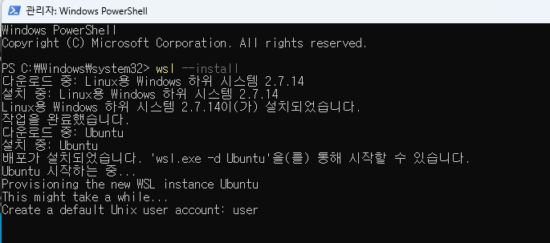

#### PostgreSQL 이미지 다운로드

- 이미지 : 도커 리포지토리에 미리 만들어놓은 시스템 패키지
- 컨테이너 : 나의 도커에서 미리 다운로드 받은 이미지를 동작시킨 시스템

#### 도커 명령어

```bash
docker --version
```

- 설치된 도커 확인

##### 도커에서 PostgreSQL 이미지 다운로드

```bash
docker pull postgres
```

- Docker Desktop 전체 검색에서 pull(다운로드)

#### 컨테이너 실행

##### 도커 명령어로 실행

- 여러 옵션으로 실행을 해야하므로 거의 대부분 명령어로 실행

```bash
docker run --name my-postgres -e POSTGRES_PASSWORD=123456 -p 25432:5432 -d postgres:latest
```

#### DBeaver에서 접속

그림 생략

#### DB 기본 사용법

##### PostgreSQL 기본구조

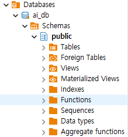

- ai_db - 데이터베이스 (프로젝트 전체 공간)
- Schemas - 프로젝트 폴더
- Tables - 실제 데이터를 담는 표

#### DB 생성

- SQL 편집기 클릭
- 새 이름으로 저장 ,  *.sql로 저장
- 아래의 코드를 작성

```sql
create database ai_db; 
```

- Ctrl + Enter로 쿼리 실행
- DB 접속 정보에서 Show All databases를 체크하고 재접속
- 데이터베이스 생성 확인

### 테이블 생성

- 데이터베이스 스키마를 사용 할 데이터베이스로 반드시 선택

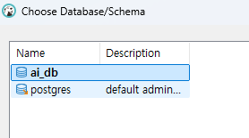

- 아래의 코드 작성

```sql

-- 데이터 생성
create table students (
	id int generated always as identity primary key, -- 학생 구분 값 자동 증가
	name varchar(50) not null, -- 이름
	age int, -- 나이  
	email varchar(100), -- 이메일
	created_at timestamp default current_timestamp -- 현재 작성된 일자 
);
```

- Ctrl + Enter로 실행

  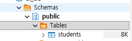
- 실행 결과

### 데이터 생성

- insert 쿼리 작성

  ```sql
  -- 데이터 삽입(INSERT)
  insert into public.students (name, age, email)
  values ('홍길동', 20, 'honggd@example.com');

  insert into public.students (name, age, email)
  values ('김철수', 21, 'kim@gmail.com'),
  	('이영희', 21, 'lee@gmail.com'),
  	('박민수', 22, 'park@gmail.com'),
  	('성명건', 50, 'sung@gmail.com');
  ```
- select 쿼리 작성 - 난이도가 올라감

```sql
-- 데이터 확인(SELECT)
select * from public.students;

```

- update 쿼리 작성

```sql
-- 데이터 수정(UPDATE)
update students set
		email = 'hong@kakao.com'
where id = 1;
```

- delete 쿼리 쿼리 작성

```sql
-- 데이터 삭제(DELETE)
delete from students 
 where name = '홍길동';
```

- CRUD - Create, Read, Update, Delete 의 약자

  - C - INSERT
  - R - SELECT
  - U - UPDATE
  - D - DELETE

#### Postgres 기본타입


| 데이터 타입 | 설명                          | 예제                    |
| ----------- | ----------------------------- | ----------------------- |
| INT         | 정수                          | 10, 25, -9              |
| BIGINT      | 큰 정수                       | 10000000000             |
| NUMERIC     | 정확한 소수                   | 12000.56                |
| VARCHAR(n)  | 길이 제한 문자열(4000자 이하) | '홍길동'                |
| TEXT        | 긴 문자열(대략 1GB)           | 뉴스 게시물, 본문       |
| BOOLEAN     | 참 또는 거짓                  | true, false             |
| DATE        | 날짜                          | 2026.09.15              |
| TIMESTAMP   | 일자(날짜와 시간)             | 2026.09.15 16:00:20.456 |
| JSONB       | JSON 데이터                   | {"name" : "홍길동"}     |

## 2일차

#### SQL 기본

데이터베이스 내용에서 가장 기본적인 문법 CRUD

- SQL : Structured Query Language (구조화된 질의 언어)
- 쿼리로 통칭

#### CRUD 정의

데이터 **처리의 기본 동작** 네 가지


| 구분   | 의미              | 쿼리 명령어 |
| ------ | ----------------- | ----------- |
| CREATE | 데이터 생성(삽입) | `INSERT`    |
| READ   | 데이터 읽기(조회) | `SELECT`    |
| UPDATE | 데이터 수정(변경) | `UPDATE`    |
| DELETE | 데이터 삭제       | `DELETE`    |

- 학생 관리 프로그램을 만든다고 가정하면,
  - 학생을 등록
  - 학생 목록 조회 / 특정 학생 내용 조회
  - 특정 학생 내용 조회
  - 학생 정보 수정
  - 학생 정보 삭제

##### 데이터 생성

- 항상 SELECT 쿼리로 확인하세요
- INSERT 쿼리로 데이터추가

```sql
  -- 학생 정보 추가 쿼리
  insert into students (name, age, email)
  values ('홍길동', 20, 'hong@example.com');
  
  -- 컬럼 순서 변경. 키와 값의 순서는 일치해야 함 
  insert into students (age, email, name)
  values (29, 'minjoon@gmail.com', '권민준');
  
  -- 여러 데이터 추가 
  insert into students (name, age, email)
  values ('홍길순', 20, 'hong1@example.com'),
         ('홍길자', 50, 'hong2@example.com'),
         ('홍길매', 30, 'hong3@example.com');
```

##### 데이터 조회

- SELECT 쿼리로 조회 - [소스](./day02/practice02.sql)
- 처음에는 간단하지만, 뒤로 갈 수록 어려워짐

```sql
 -- 특정 컬럼만 조회
  select s.name , s.age  from students s;   
  
  SELECT id, "name", age, email, created_at
  FROM public.students;
  
  -- 필터링! 필요한 데이터만 조회 
  select * from students s
   where s.age < 30 ;
```

##### 데이터 활용 조회

- 정렬
  - `ASC`ending : 오름차순
  - `DESC`ending : 내림차순
- Limit - 필요 개수만큼 조회

##### 데이터 수정

- UPDATE 쿼리로 수정 - 소스
- UPDATE 쿼리 실행 시 WHERE 절 없이 실행 주의할 것!

  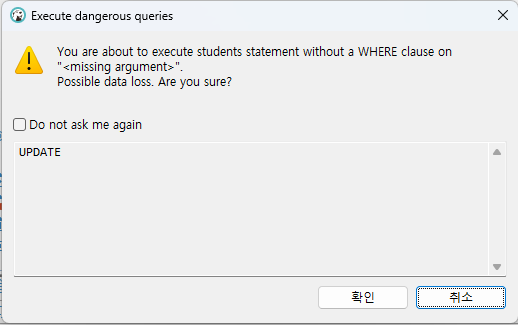

##### 데이터 삭제

- DELETE 쿼리로 삭제
- DELETE 쿼리 실행 시도 WHERE 절 없이 실행 주의할 것!
- 삭제도 UPDATE와 동일한 경고메시지 창 표시됨

##### 테이블 삭제

- DELETE는 데이터 삭제, DROP은 테이블 자체 삭제

#### NULL

- 값이 없다는 뜻, 숫자 0이나 빈 문자열('')과 다른 의미 ' '과도 다름

#### TABLE 생성

테이블 생성 쿼리

```sql
-- 테이블 생성
create table students (
id INT GENERATED ALWAYS AS IDENTITY PRIMARY KEY, -- 기본키(PK) - 중복안되고 NOT NULL 
name VARCHAR(50) NOT NULL, -- 이름은 NULL이 될 수 없다.
age INT, -- 나이 NULL 
email VARCHAR(100), -- 이메일 NULL
major VARCHAR(50), -- 전공 NULL
created_at TIMESTAMP DEFAULT CURRENT_TIMESTAMP -- NULL이 들어갈 수 있음 
);
```

##### NULL

- 값이 없다는 뜻, 숫자 0이나 빈 문자열('')과 다른 의미 ' '과도 다름

##### 

##### NULL 사용 쿼리

```sql
-- 데이터 추가
insert into students (name, age, email, major)
values('홍길동', 20, 'hong@example.com', '컴퓨터공학');

-- 전공에 null을 집어 넣음
insert into students (name, age, email, major)
values('성유고', 20, 'hugo@example.com', null );

insert into students (name, age, email, major)
values('성미나', null, 'mina@example.com', null );

insert into students (name)
values ('최민식');

```

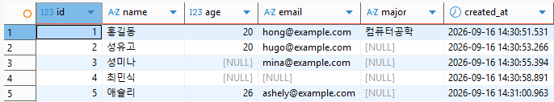

##### NULL 조회 쿼리

- `where 쿼리 is null / is not null`

#### 테이블 설계

- 일반적으로 DB설계, 테이블 설계 통칭

#### 필요 개념

- 테이블 설계 - 논리적 테이블 설계, 물리적 테이블 설계
- 컬럼과 데이터 타입 선택
- 기본키(PK) / 외래키(FK) 제약조건
- NOT NULL, UNIQUE, CHECK, 제약조건
- DEFAULT 제약조건
- 테이블 관계

학생과 과목 수강 관리 테이블 설계

##### 테이블 설계?

데이터를 어떤 테이블에 어떤 컬럼에 어떠한 관계를 가지고 저장할 지 규정하는 작업

- 학생정보
  - 이름
  - 나이
  - 이메일
  - 전공
  - 수강과목
  - 담당 강사
  - 수강신청일

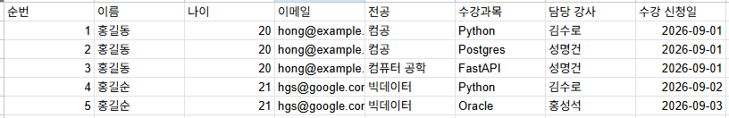

- 엑셀에서는 데이터를 제대로 관리하기 힘들다

##### 좋은 테이블 설계

- 같은 데이터가 불필요하게 중복되지 않게 한다
- 한 테이블은 하나의 주제를 가진다
- 각 행(row)을 구분할 수 있는 기본키(PK)를 가진다
- 테이블 간의 관계가 외래키(FK)로 연결한다
- 잘못된 데이터가 들어가지 않도록 제약조건을 사용한다
- 조회, 수정이 이해하기 쉬운 구조여야 한다

##### 학생 테이블 컬럼 데이터타입 선택


| 구분           | 설명                       | 데이터타입                |
| -------------- | -------------------------- | ------------------------- |
| 학생번호`id`   | 학생을 구분, 반드시 필요   | `INT`, BIGINT, NUMERIC 중 |
| 학생이름`name` | 문자열로 추가, 반드시 입력 | `VARCHAR(50)`, TEXT 중    |
| 이메일`email`  | 문자열, 선택으로 입력      | `VARCHAR(200)`, TEXT      |
| 나이`age`      | 숫자, 150살 이하로만 제약  | INT...                    |
| 전공`major`    | 문자열                     | VARCHAR(n), TEXT          |
| 등록일자`date` | 학생 정보를 입력한 일시    | DATE, TIMESTAMP 중        |

- 정확한 숫자는 numeric, 긴 글은 text, 날짜만 필요하면 date, 참/거짓은 boolean


#### 제약조건

##### 기본키

테이블에서 각 행(row) 구분하는 대표값, Primary Key(PK) - Unique의 Not Null

- 중복 불가!
- 비어있을 수 없다!
- 한 행을 대표
- 다른 테이블에서 참조한다

PostgreSQL은 `generated always as identity` 숫자 타입의 자동증가, `primary key` 가 기본키임을 지정한다

```sql
id int generated always as identity primary key
```

MySQL에서 auto_increment, Oracle에서 identity 로 문법이 다름.


##### 2. 외래키

다른 테이블의 기본키를 참조하는 컬럼. Foreign Key(FK)


```plaintext
Students(학생)
 - id : 학생아이디 PK
 - name : 학생이름

Enrollments(수강)
 - id : 수강아이디 PK
 - student_id : 학생아이디 FK
 - course_name : 수강명
```


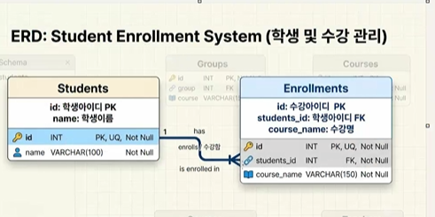
